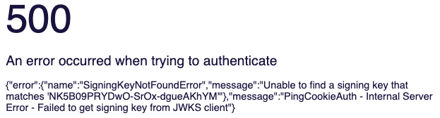
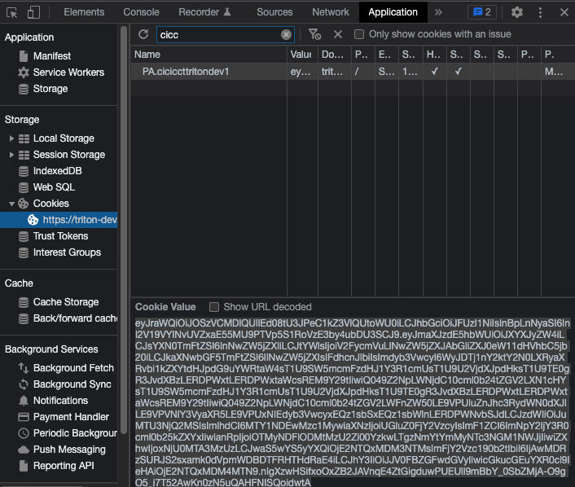

# Running the Softphone Admin UI Locally

This document offers some tips and tricks for running the Admin UI locally.

## The Authentication Cookie

When you first fire up the Admin UI, you likely see this error:

This error is caused by a missing or expired session cookie.  

To fix it, follow these steps:
1. Open a new Chrome tab, and navigate to the development instance
of the Triton UI at:  https://triton-dev.lmig.com/triton-admin
2. Open the Chrome Development Tools window (F12)
3. Select the Application tab, and then expand Cookies on the left
4. Click on the https://triton-dev.lmig.com site
5. Click on the PA.ciciccttritondev1 cookie
6. Copy the value of the cookie to the clipboard
7. Go back to the Chrome tab for your local instance
8. Find the same cookie and update its value from the clipboard.  If it doesn't exist,
create it from the browser console.
9. This cookie expires every 30 minutes, so you may have to go through this
procedure twice if you copy the dev cookie just before it expires

