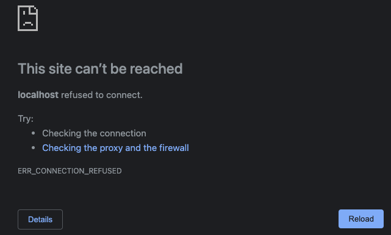

# Running the Softphone Admin UI Locally

This document offers some tips and tricks for running the Admin UI locally.

## Running cicct-callflow-api locally
When this project is run as described in the main [ReadMe](../README.md), the softphone-service will
make calls to the callflow-api located in Liberty's development environment.
If you want to run the callflow-api locally instead, follow these steps:
1. Download and configure the [cicct-callflow-api repository](https://github.com/lmigtech/cicct-callflow-api/tree/CCT-4900-Update-Triton-UI-ReadMe) as described in its ReadMe
1. Start the callflow-api as described in its ReadMe
1. Change the CALLFLOW_API_BASE_URL environment variable for the softphone-service to `http://localhost:8081/api`
1. Restart the softphone-service

You should now have these four respositories running on these ports:
```
cicct-user-gateway        8082
cicct-softphone-admin-ui  8084
cicct-softphone-service   8080
cicct-callflow-api        8081
```

## The Session Cookie

When you first fire up the Admin UI, you likely see this error:


This error is caused by a missing or expired session cookie.  

To fix it, follow these steps:
1. Open a new Chrome tab, and navigate to the development instance
of the Triton UI at:  https://triton-dev.lmig.com/triton-admin
2. Open the Chrome Development Tools window (F12)
3. Select the Application tab, and then expand Cookies on the left
4. Click on the https://triton-dev.lmig.com site
5. Click on the PA.ciciccttritondev1 cookie
6. Copy the value of the cookie to the clipboard
7. Go back to the Chrome tab for your local instance
8. Find the same cookie and update its value from the clipboard.  If it doesn't exist,
create it from the browser console.
9. This cookie expires every 30 minutes, so you may have to go through this
procedure twice if you copy the dev cookie just before it expires


## Site Can't Be Reached


There are a couple of things that may cause this error:
1. Your browser should be pointed at:  http://localhost:8082/triton-admin
2. the cicct-user-gateway and cicct-softphone-service repos must be running on your desktop, 
as described in the [main readme](../README.md).

